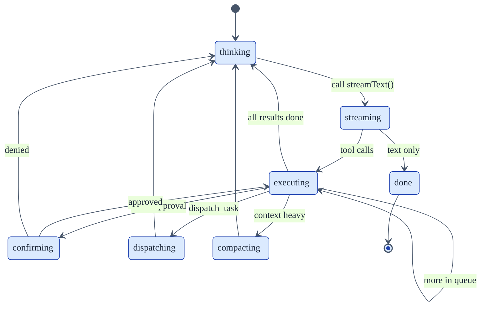

# State Machine

The Amodal agent loop is built as an **explicit state machine** — a discriminated union of states plus a `transition()` function that dispatches to a handler per state. This is what runs every time you send a message to an agent.

The outer loop is trivial:

```typescript
async function* runAgent(options): AsyncGenerator<SSEEvent> {
  let state: AgentState = { type: 'thinking', messages }
  yield { type: 'init', session_id }

  while (state.type !== 'done') {
    const { next, effects } = await transition(state, ctx)
    for (const event of effects) yield event  // SSE to the client
    if (ctx.signal.aborted) { state = { type: 'done', reason: 'user_abort', usage }; continue }
    if (ctx.turnCount >= ctx.maxTurns) { state = { type: 'done', reason: 'max_turns', usage }; continue }
    state = next
  }

  yield { type: 'done', usage: ctx.usage }
}
```

Every piece of the runtime logic lives inside the state handlers. The loop just drives transitions and yields events.

## The states



| State | What happens | Next |
|---|---|---|
| `thinking` | Compile system prompt, check for loops, clear old tool result bodies, call `streamText()`. | `streaming` (always) |
| `streaming` | Consume the provider's streamed response — emit `text_delta` events, collect tool calls. | `done` (text only) or `executing` (tool calls) |
| `executing` | Run the next tool in the queue, emit `tool_call_start`/`tool_call_result`, append results to the message history. | `confirming` (needs approval), `dispatching` (sub-agent), `executing` (next in queue), `compacting` (context heavy), or `thinking` |
| `confirming` | Tool call needs user approval (ACL rule or `requiresConfirmation` flag). Emit `confirmation_required`, wait for response. | `executing` (approved) or `thinking` (denied) |
| `dispatching` | Sub-agent runs in its own isolated state machine with the parent's tools/stores. Result becomes a tool result in the parent. | `thinking` |
| `compacting` | Context exceeded threshold — summarize older turns into a structured snapshot and replace them. | `thinking` |
| `done` | Terminal. Carries `usage` and `reason`. | — |

## Why a state machine

The alternative is an imperative `while` loop (what most agent frameworks do) with implicit states hidden in if/else branches and variable flags. That works for simple agents but breaks down when you need to:

- **Pause mid-loop for user confirmation** — an imperative loop has to awkwardly yield control to the transport layer, then resume with callbacks or blocking.
- **Insert compaction, loop detection, or sub-agent dispatch** without tangling the control flow — new features become new states + new transitions, not if-branches scattered through the loop body.
- **Test phases independently** — each state handler is a pure function: `(state, ctx) → { next, effects }`. You can test the compaction handler without running the whole loop.
- **Answer "what state is the agent in right now?"** with a single variable instead of reconstructing it from flags.

The tradeoff: more code upfront, unfamiliar pattern for developers who haven't worked with state machines. We think it's worth it once you hit the features above — and we hit all of them.

## Exhaustiveness is enforced by the compiler

The `transition()` dispatcher uses the TypeScript `never` trick:

```typescript
switch (state.type) {
  case 'thinking':     return handleThinking(state, ctx)
  case 'streaming':    return handleStreaming(state, ctx)
  // ... all states ...
  default: {
    const _exhaustive: never = state
    throw new Error(`Unhandled agent state: ${(_exhaustive as AgentState).type}`)
  }
}
```

If someone adds a new state variant (say, `reviewing`) and forgets to add a case, the `_exhaustive` assignment fails to compile. Silent fallthrough is impossible.

## State data is minimal

Each state variant carries **only** what its handler needs:

```typescript
type AgentState =
  | { type: 'thinking'; messages: ModelMessage[] }
  | { type: 'streaming'; stream: StreamTextResult; pendingToolCalls: ToolCall[] }
  | { type: 'executing'; queue: ToolCall[]; current: ToolCall; results: ToolResult[] }
  | { type: 'confirming'; call: ToolCall; remainingQueue: ToolCall[] }
  | { type: 'compacting'; messages: ModelMessage[]; estimatedTokens: number }
  | { type: 'dispatching'; task: DispatchConfig; toolCallId: string; queue: ToolCall[]; results: ToolResult[] }
  | { type: 'done'; usage: TokenUsage; reason: DoneReason }
```

No shared "agent context" object leaks between states. The stuff that really is shared (provider, tool registry, logger, message history) lives on `AgentContext`, which is passed to every handler.

## SSE events are return values

State handlers return `{ next, effects }` where `effects` is a list of SSE events. The outer loop yields them. This means:

- **Business logic doesn't know about transport.** Handlers don't call `res.write()` or `sendEvent()`. They just return events.
- **The same loop runs over HTTP, in automations, and in eval runners.** Each caller decides what to do with the yielded events.
- **Testing is trivial.** Call `transition(state, ctx)`, assert on `next` and `effects`.

## Done reasons

The `done` state always carries `reason: DoneReason` and the final `usage`:

| Reason | When |
|---|---|
| `model_stop` | The model finished without requesting more tool calls |
| `max_turns` | The turn budget was exhausted |
| `user_abort` | The abort signal fired |
| `error` | An unrecoverable error occurred inside a state handler |
| `budget_exceeded` | A session token budget was exceeded (reserved — not yet produced) |
| `loop_detected` | Loop detection hit the hard-stop threshold |

The final `done` SSE event is yielded **unconditionally** with the accumulated usage — regardless of which reason triggered it. Downstream (audit log, usage reporting, the client) always sees token costs.

## Where to find it

| File | What's in it |
|---|---|
| `packages/runtime/src/agent/loop.ts` | The `runAgent` generator and `transition()` dispatcher |
| `packages/runtime/src/agent/loop-types.ts` | `AgentState`, `AgentContext`, `DoneReason`, `TransitionResult` |
| `packages/runtime/src/agent/states/` | One file per state handler |

See [The Core Loop](/learn/architecture/core-loop) for the conceptual model this state machine implements.
